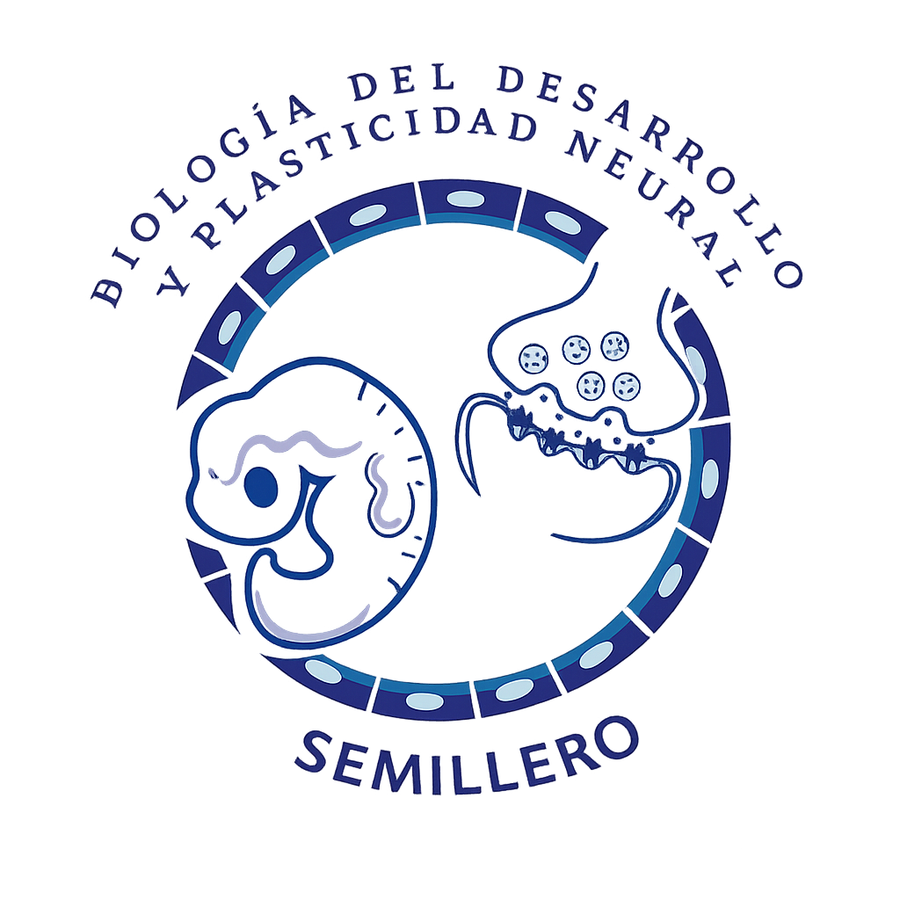

Sitio web del curso precongreso de la botánica a la bioinformática: estrategias para la identificación de metabolitos con potencial farmacológico

📅 **Fecha:** 3 y 4 de noviembre del 2026

🕐 **Horario:** Por confirmar

📍 **Lugar:** Medellín, Colombia

👥 **Cupos:** 20

💰 **Inversión:** 110.000 COP

📝 **Inscripción:** en la página del [XIII Congreso Colombiano de Botánica](https://acb.org.co/xiiiccb2026/)

✉️ **Contacto:** [xgarcia\@unicauca.edu.co](mailto:xgarcia@unicauca.edu.co)

# Descripción del curso

Durante milenios, la medicina tradicional ha sido preservada por comunidades indígenas, campesinas y afrodescendientes como un sistema de conocimiento para el manejo, diagnóstico, prevención y tratamiento de enfermedades. Este saber constituye un componente clave de los sistemas de salud en diversas regiones del mundo. Según la Organización Mundial de la Salud (OMS), cerca del 80 % de la población mundial recurre a la medicina tradicional, complementaria o ancestral. En este contexto, las regiones neotropicales destacan como hotspots de biodiversidad vegetal. Colombia alberga aproximadamente 26.134 especies de plantas vasculares, de las cuales cerca de 5.000 presentan relevancia medicinal. Esta riqueza etnofarmacológica y fitoquímica ha favorecido la identificación de metabolitos secundarios fundamentales en el descubrimiento de nuevos fármacos con potencial frente a enfermedades cardiovasculares, dermatológicas y neurodegenerativas. En consecuencia, estos enfoques permiten la identificación de compuestos con potencial aplicación en el tratamiento de diversas enfermedades cardiovasculares, dermatológicas y neurodegenerativas. Paralelamente, el avance de la bioinformática ha facilitado el análisis de parámetros clave para el desarrollo de fármacos, como la absorción, distribución, metabolismo, excreción y toxicidad (ADMET), y la predicción de interacciones con dianas moleculares específicas. Este progreso ha impulsado la consolidación de estudios in silico que integran química estructural, física, biología, aprendizaje automático e inteligencia artificial, sustentados además en los principios de las 3R (reemplazo, reducción y refinamiento), promoviendo enfoques más éticos y eficientes. En los últimos años, han transformado el descubrimiento de fármacos al permitir la identificación temprana de compuestos terapéuticos, reduciendo costos y el uso de modelos animales, y facilitando la predicción de toxicidad, afinidad molecular y eficiencia biológica para optimizar la selección de candidatos preclínicos. En ese sentido, el curso propone ejemplificar, a partir de plantas de interés medicinal, la aplicación de estrategias bioinformáticas para la filtración y priorización de metabolitos previamente caracterizados, considerando parámetros farmacocinéticos, farmacodinámicos, ADMET y la afinidad entre ligando y proteína diana. La metodología planteada es de carácter teórico-práctico y se desarrollará en cinco capítulos distribuidos durante dos días. El capítulo 1 abordará la conceptualización histórica del uso de plantas medicinales, así como los aspectos éticos relacionados con la búsqueda de nuevos fármacos. El capítulo 2 se centrará en métodos de extracción, cuantificación y caracterización fitoquímica. El capítulo 3 incluirá fundamentos de biodisponibilidad, farmacodinámica y la interacción de proteína-ligando. Finalmente, el capítulo 4 y 5 estarán orientados a la priorización de metabolitos con potencial terapéutico y al uso de herramientas bioinformáticas como Swiss ADME, Swiss Target Prediction, PASS Online para la evaluación de parámetros ADMET y similitud a fármacos. Asimismo, se emplearán AutoDock y PyMOL para el análisis y visualización de la afinidad proteína-ligando, y R Studio para el procesamiento y análisis de datos.

# Objetivos del curso

-   Describir el uso y aplicación de algunas herramientas bioinformáticas para la identificación de metabolitos fitoquímicos con potencial farmacéutico.

-   Identificar y caracterizar plantas medicinales con potencial farmacológico.

-   Describir el uso de algunos softwares utilizados en la identificación de metabolitos con potencial terapéutico.

-   Aplicar software en ejercicios reales para la identificación de metabolitos con potencial farmacológico. 

# Metodología

El curso adopta una metodología teórico-práctica estructurada en cinco capítulos intensivos, desarrollados a lo largo de dos días. Las sesiones inician con la contextualización histórica, ética y etnofarmacológica del uso de plantas medicinales neotropicales, para luego abordar las técnicas tradicionales de extracción, cuantificación y caracterización de metabolitos secundarios de interés farmacológico. Sobre esta base biológica, se introducen los fundamentos teóricos de biodisponibilidad, farmacodinámica y dinámicas de interacción entre ligando y proteína diana.

La fase práctica integra el uso de herramientas bioinformáticas e in silico aplicadas a la priorización de metabolitos candidatos, sustentadas en el principio ético de las 3R (reemplazo, reducción y refinamiento de modelos animales). Mediante plataformas como SwissADME, SwissTargetPrediction y PASS Online, los participantes evalúan parámetros de farmacocinetica, toxicidad (ADMET) y similitud a fármacos. Posteriormente, efectúan simulaciones de acoplamiento molecular y visualización de afinidades con AutoDock y PyMOL, complementando el flujo de trabajo con el procesamiento y análisis de datos estadísticos a través de RStudio.

# Requisitos

-   Debido a las restricciones sujetas por la institución organizadora, se requiere que cada participante disponga de su propio ordenador personal. En este equipo, deberá estar instalado el software requerido para la ejecución del mismo. 
-   No se requieren conocimientos previos.

# Instructores

***

::: columns
::: {.column width="25%"}

:::

::: {.column width="5%"}
:::

::: {.column width="70%"}
[**Xavier Clemente García Cevallos**](https://xavierclementegarcia.github.io/) Estudiante de Biología interesado en biología computacional, descubrimiento de fármacos y biología molecular. Experiencia en bioinformática estructural, acoplamiento molecular, análisis ADMET y programación científica (R y Python), complementada con investigación en productos naturales y enfermedades neurodegenerativas. Autor de publicaciones científicas y ponente en congresos nacionales e internacionales.
:::
:::

***

***

::: columns
::: {.column width="25%"}

:::

::: {.column width="5%"}
:::

::: {.column width="70%"}
[**Ariadna Vasquez Ledezma**](https://bioden.github.io/bioden_website/integrantes/ariadna.html) Se desempeña en el área de Toxicología Genética y Citogenética, con enfoque en Epigenética, Biología del Desarrollo y Salud Ambiental. Su trabajo se centra en la evaluación de factores de riesgo asociados a la exposición a contaminantes, integrando herramientas moleculares y celulares para comprender los mecanismos de daño genético. Actualmente desarrolla investigaciones sobre los efectos del material particulado en la salud humana, especialmente en poblaciones ocupacionalmente expuestas, con el objetivo de aportar evidencia científica que oriente estrategias de prevención y protección de la salud.
:::
:::

***

***

::: columns
::: {.column width="25%"}

:::

::: {.column width="5%"}
:::

::: {.column width="70%"}
[**Sebastian Scalante Aguillón**](https://bioden.github.io) Pendiente de descripción para el curso
:::
:::

***

***

::: columns
::: {.column width="25%"}

:::

::: {.column width="5%"}
:::

::: {.column width="70%"}
[**Willian Orlando Castillo Ordóñez, PhD**](https://bioden.github.io/bioden_website/integrantes/Willian_Castillo.html) Es Biólogo y actualmente profesor del Departamento de Biología de la Universidad del Cauca. Obtuvo su doctorado en Genética por la Facultad de Medicina de la Universidad de Sao Paulo–Brasil con investigación dirigida a la identificación de compuestos de origen vegetal como moduladores de la Enfermedad de Alzheimer. Su investigación se focaliza en las propiedades anticolinesterásicas y antioxidantes de vegetales pertenecientes a la familia Amaryllidaceae; integrando estudios mecanísticos de antimutagenicidad, neurotoxicidad, neuroprotección, diferenciación celular, reparación y regulación epigenética del ADN; complementando con métodos de predicción en Sílico: Simulación por Docking y Dinámica Molecular.
:::
:::

***

# Contenido del curso

## Unidad 0: Prefacio

-   [Instalación de programas y primeros pasos](paginas/index.qmd)

## Día 1

### Unidad 1: Conceptualizaciones, plantas, conservación y medicina tradicional 

-   Historia del uso de las plantas y origen de la etnobotánica
-   Etnomedicina y etnofarmacognosia
-   Aspecto éticos de la etnobotánica y la etnofarmacología

### Unidad 2: Transiciones entre la medicina tradicional al enfoque experimental
-   Métodos de extracción de comppuestos vegetales
-   Técnicas de cuantificación de principios activos
-   Estrategias de caracterización de preparados etnomedicinales 

### Unidad 3: De lo experimental a lo computacional
-   Concepto de proteína y ligando
-   Biodisponibilidad y farmacodinámica
-   Métodos de validación experimental 
-   Presentación de bases de datos

## Día 2 
### Unidad 4: Priorización de metabolitos y diseño racional de fármacos  
-   Criterios de selección y principios ADMET 
-   ¿Qué es el diseño racional de fármacos? 
-   ¿Qué es el acoplamiento molecular?
-   Limitaciones metodológicas y perspectivas futuras

### Unidad 5: Caso de estudio
-   Selección de especie vegetal
-   Construcción de matriz potencial de metabolitos
-   Priorización según criterios ADMET
-   Predicción de blancos moleculares
-   Predicción de actividad biológica y toxicológica
-   Acoplamiento molecular proteína-ligando
-   Visualización y análisis de interacciones 

# Licencia

<a rel="cc:attributionURL" href="https://bioden.github.io/bioden_website/">This work</a> by <a rel="cc:attributionURL dct:creator" property="cc:attributionName" href="https://xavierclementegarcia.github.io/">Xavier Clemente García Cevallos</a> is licensed under <a href="https://creativecommons.org/licenses/by/4.0/?ref=chooser-v1" target="_blank" rel="license noopener noreferrer" style="display:inline-block;">CC BY 4.0</a>

